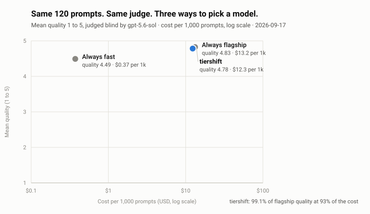

# tiershift

**Shift every LLM call to the cheapest model that can handle it.**
Routing decided by [TypeSafe Jev](https://docs.typesafe.ai) in about 300 ms for $0.00004 per call. No training data. Policy in plain YAML. Prices and limits synced from [models.dev](https://models.dev).

```
$ tiershift ask "ok thanks"
→ ollama/qwen2.5:7b   tier=local
  rule "trivial_ack > 0.8" → local

$ tiershift ask "What is the capital of France? One word."
→ deepseek/deepseek-flash   tier=fast
  rule "difficulty < 0.5" → fast

$ tiershift ask "Explain the difference between optimistic and pessimistic locking in two sentences."
→ openai/gpt-5.6-terra   tier=mid
  rule "difficulty < 1.3" → mid

$ tiershift ask "In one paragraph, review this indemnification clause for risk: Vendor shall indemnify Client against all claims arising from any cause whatsoever."
→ openai/gpt-5.6-sol   tier=flagship
  rule "difficulty < 1.3" → mid  |  override "stakes > 1.5" → at_least flagship
  jev 323 ms · model 6407 ms · 32 in / 190 out · cost $0.003928
```

Real output from one laptop session with Ollama, DeepSeek, and OpenAI keys. The legal clause was only "mid" difficulty, but stakes scored 1.99 out of 2, so an override lifted it to the flagship tier.

## Why

An agent run has ten steps. Seven are trivial: acknowledge a tool result, reformat, pick a branch. Most agents send all ten to the flagship model. tiershift sends each step to the cheapest tier that can handle it, and moves up when the stakes are high, the confidence is low, or a retry happened.

Existing routers learn a black box from labeled data and need retraining when you add a model. tiershift asks Jev ten narrow questions about the prompt, then applies rules you can read. Adding a model is one YAML line.

| | RouteLLM | NotDiamond | tiershift |
|---|---|---|---|
| Training data | preference pairs | 15 to 10,000 labels | none |
| Add a model | retrain | retrain | one YAML line |
| Policy | learned | learned | plain YAML, inspectable |
| Signals per route | 1 | 1 | 10 from Jev, plus token count, tools, step, retries |
| Every decision logged with probabilities | no | no | yes |
| Route latency | ~10 ms local | ~100 to 200 ms | ~300 ms |

Honest note: a local classifier is faster. Next to a 5-second flagship call, 300 ms is small. Next to a 1-second small-model call, it is a real overhead. The pitch is zero training, transparent policy, and multi-signal escalation.

## How it works

```
prompt ─► code signals ─► Jev: 10 questions, one call ─► YAML rules and overrides ─► model + fallback ─► provider call
          tokens, tools,     difficulty, stakes, reasoning,    thresholds on probabilities;      retry one tier up
          step, retries      domain, length, safety, ...       context, capability, budget checks   on failure
```

Jev judges meaning. Code does arithmetic. Jev never sees prices or token counts, because [Jev is not a calculator](https://docs.typesafe.ai/model-jaggedness/jev-1.13). Code checks context fit, estimates cost from `prices.yaml`, and skips models over budget.

## Install

```bash
npm install tiershift
export TYPESAFE_API_KEY=...        # get one at typesafe.ai
```

Provider keys are optional. A tier skips any model whose key is missing. With only [Ollama](https://ollama.com) running, everything routes to the local model and the decision is flagged `degraded: true`.

## Use

### Decide, then call the model yourself

```ts
import { createRouter } from "tiershift";

const router = createRouter();                  // reads ./tiershift.yaml, else the bundled default

const d = await router.route({
  messages,                                     // your conversation so far
  tools,                                        // optional tool definitions
  step: "plan",                                 // optional agent step type
  retries: 0,                                   // optional; each retry moves one tier up
});

d.model        // "deepseek/deepseek-flash"
d.tier         // "fast"
d.fallback     // "openai/gpt-5.6-terra"        use this if the call fails
d.signals      // { difficulty: 0.31, stakes: 0.12, needs_reasoning: 0.08, ... }
d.reason       // ['rule "difficulty < 0.5" → fast']
d.est_cost_usd // 0.00006
```

### Decide, call, and fall back in one step

```ts
const r = await router.complete({ messages, tools, maxTokens: 1024 });

r.text          // the answer
r.tool_calls    // [{ id, name, arguments }]
r.model         // the model that answered; differs from r.decision.model when a fallback ran
r.fell_back     // false
r.cost_usd      // actual cost from reported usage and prices.yaml
r.attempts      // [{ model, ok, latency_ms, error? }]
```

`complete()` tries the chosen model, then the fallback one tier up. Provider errors carry the HTTP status, and 4xx validation errors do not trigger a fallback.

## Configure

Copy `tiershift.yaml` into your project and edit. Every threshold is a probability or score from Jev.

```yaml
providers:
  ollama:    { type: openai-compatible, base_url: http://localhost:11434/v1 }
  deepseek:  { type: openai-compatible, base_url: https://api.deepseek.com, api_key_env: DEEPSEEK_API_KEY }
  openai:    { type: openai-compatible, base_url: https://api.openai.com/v1, api_key_env: OPENAI_API_KEY }
  anthropic: { type: anthropic, api_key_env: ANTHROPIC_API_KEY }

tiers:                                  # preference order within a tier
  local:    [ollama/qwen2.5:7b]
  fast:     [deepseek/deepseek-flash, openai/gpt-5.6-luna, anthropic/claude-haiku-4-5]
  mid:      [openai/gpt-5.6-terra, deepseek/deepseek-v4-pro, anthropic/claude-sonnet-5]
  flagship: [anthropic/claude-fable-5-1, openai/gpt-5.6-sol, anthropic/claude-opus-5]

models:                                 # per-model request fields; prices and limits come from prices.yaml
  deepseek/deepseek-flash: { params: { thinking: { type: disabled } } }
  openai/gpt-5.6-luna:     { params: { reasoning_effort: none } }

rules:                                  # first match sets the base tier
  - { when: trivial_ack > 0.8,  tier: local }
  - { when: difficulty < 0.5,   tier: fast }
  - { when: difficulty < 1.3,   tier: mid }
  - { default: flagship }

overrides:                              # all apply, in order: at_least (floor), at_most (ceiling), up (move N)
  - { when: stakes > 1.5,                at_least: flagship }
  - { when: safety_sensitive > 0.7,      at_least: flagship }
  - { when: needs_reasoning > 0.8,       at_least: mid }
  - { when: has_tools and tier == local, at_least: fast }
  - { when: difficulty_confidence < 0.5, up: 1 }
  - { when: retries >= 1,                up: 1 }

budget:
  max_cost_per_call: 0.10               # USD; skip models above this estimate
  prefer: order                         # order | cheapest
```

Signals you can use in conditions: `difficulty`, `stakes`, `output_length` (0 to 2), `needs_reasoning`, `has_code`, `ambiguous`, `creative`, `safety_sensitive`, `trivial_ack`, `mid_tier_ok` (0 to 1), `domain` (string), `difficulty_confidence`, `stakes_confidence`, `domain_confidence`, plus code signals `has_tools`, `tool_count`, `est_input_tokens`, `retries`, `step`, `turn_count`, and the current `tier`. Overrides take `at_least` (floor), `at_most` (ceiling), or `up` (move N tiers). A typo in any name fails at load time with a did-you-mean hint.

The Jev model is pinned to `jev-1.13.0` in the YAML. Routing depends on the model, so upgrading is a deliberate edit, not a silent drift.

## Use it from any language: the proxy

```bash
tiershift serve                       # http://127.0.0.1:4141/v1
```

Point any OpenAI-compatible client at it and set `model` to `auto`. No other code changes. Python:

```python
from openai import OpenAI

client = OpenAI(base_url="http://127.0.0.1:4141/v1", api_key="unused")

r = client.chat.completions.with_raw_response.create(
    model="auto",
    messages=[{"role": "user", "content": "Review this clause for legal risk: ..."}],
)
print(r.headers["x-tiershift-model"], r.headers["x-tiershift-tier"])   # openai/gpt-5.6-sol flagship
print(r.headers["x-tiershift-reason"])   # rule "difficulty < 1.3" -> mid | override "stakes > 1.5" -> at_least flagship
print(r.parse().choices[0].message.content)
```

- `model: "auto"` routes. `model: "auto:billing"` routes and writes `billing` as the tag in the decision log.
- An explicit id such as `model: "deepseek/deepseek-flash"` bypasses routing and costs no Jev call.
- Per-model `params` in your YAML take precedence over the same fields sent by the client.
- Routed non-streaming requests write a `complete` entry with actual token usage to the decision log, so `tiershift report` shows real spend for proxy traffic. Streaming requests log the routing decision with an estimated cost, because usage is not available when piping SSE through.
- `GET /v1/models` lists `auto` plus every configured model with its tier and whether a key is present.
- Every response carries the decision in headers: `x-tiershift-model`, `x-tiershift-tier`, `x-tiershift-fallback`, `x-tiershift-confidence`, `x-tiershift-jev-ms`, `x-tiershift-reason`, plus `x-tiershift-fell-back: true` when the fallback answered. Headers never contain message text or keys.
- `stream: true` pipes the provider's server-sent events through unchanged. Streaming works for OpenAI-compatible providers. A request that routes to an Anthropic model with `stream: true` gets a clear 400; send `stream: false` for that tier in v0.1.
- Fallback to the next tier applies when the chosen provider fails before answering. A provider 4xx passes through with its status.

The proxy has no authentication. It binds to `127.0.0.1` by default. Bind elsewhere with `--host` only behind your own auth.

## Prove the saving on your own traffic

Every decision is logged to `.tiershift/decisions.jsonl` by default: signals, tier, model, cost, latency, and the reasons. Never message text. Two commands read it.

```
$ tiershift report
120 decisions in .tiershift/decisions.jsonl

tier        share     n       cost  confidence  jev p50
local         18%    22    $0.0000        0.97   202 ms
fast          33%    39    $0.0017        0.83   146 ms
mid           28%    34    $0.2036        0.56   129 ms
flagship      21%    25    $0.8057        0.61   132 ms

total $1.01 (all 120 are estimates; no model was called)
always openai/gpt-5.6-sol would cost about $1.22 for the same requests → tiershift saved 17%
jev: p50 140 ms, p95 350 ms, $0.0049 total
flags: 24 low-confidence (<0.5)
```

That is real output. The 120 prompts were routed with `route()` only, so Jev cost half a cent and no provider was called. When you use `complete()`, the log carries actual token usage and the report shows actual spend.

```
$ tiershift tune --candidate examples/policies/bolder.yaml
replayed 120 logged decisions against examples/policies/bolder.yaml. No Jev calls, no model calls.

tier        current  candidate
local            22         22
fast             39         40
mid              34         38
flagship         25         20

moved down 6, moved up 0, unchanged 114
3 would have moved on the rules alone, but an override held them
estimated cost $1.01 → $0.9672 (saves 4%)

moves to spot-check (difficulty / stakes / confidence):
  flagship → mid       1.34 / 0.60 / 0.39
  flagship → mid       1.55 / 0.91 / 0.32
  ...
```

`tune` replays the logged signals against another YAML. It costs nothing, because the signals are already in the log. It tells you which requests would move, in which direction, and what the estimated cost change is. It does not measure quality. Sample the moved requests before you adopt a candidate.

Disable logging with `log: { enabled: false }` in the YAML, or `createRouter({ log: false })`. Add a `tag` to each call to split the report by agent or tenant later.

## Keep prices and limits current

```bash
tiershift sync-models            # dry run: show what would change
tiershift sync-models --write    # update prices.yaml
```

Prices, context windows, max output, and capabilities come from [models.dev](https://models.dev/api.json), a free, open-source, key-less index of about 7,800 models across 220 providers. The bundled GitHub Action runs the sync every Monday and opens a pull request when anything changed. Local models get price zero. Unknown models still route and log cost as null.

Note on DeepSeek: it publishes peak rates and half-price off-peak rates. models.dev carries the off-peak rate. Override in `tiershift.yaml` under `models:` if you want the peak rate for a conservative estimate.

## Provider quirks handled for you

All verified against live APIs on 2026-09-17.

| Provider | Quirk | What tiershift does |
|---|---|---|
| OpenAI gpt-5.x | rejects `max_tokens` | sends `max_completion_tokens` |
| OpenAI gpt-5.6 | rejects function tools unless `reasoning_effort: none` | default config sets it per model |
| DeepSeek flash | thinks by default and spends the token budget on reasoning | default config disables thinking on the fast tier |
| Ollama | 60 times slower with `max_completion_tokens` | sends `max_tokens` |
| Any reasoning model | spends output tokens thinking first; a small budget returns an empty answer at full price | raises `max_tokens` to `defaults.min_output_tokens` (1024), and treats an empty answer with finish reason `length` as a failure so the fallback runs |

## CLI

```bash
tiershift serve [--port 4141]          # OpenAI-compatible proxy; clients set model "auto"
tiershift check                        # which configured models have keys
tiershift route "your prompt"          # decide only; print signals and reasons; no model call
tiershift ask "your prompt"            # decide, call the model, fall back on failure
tiershift report [--log path]          # tier mix, spend, saving vs always-flagship from the log
tiershift tune --candidate other.yaml  # replay the log against another policy; no API calls
tiershift sync-models [--write]        # refresh prices.yaml from models.dev
```

Add `--json` for the full object and `--config path` for a custom policy.

## Benchmark

120 prompts in four categories (acknowledgements, simple, moderate, hard), three arms, one blind judge. Full method and every raw record in [bench/](bench/).



| Arm | Mean quality (1 to 5) | Cost per 1,000 prompts | p50 latency |
|---|---|---|---|
| Always flagship (gpt-5.6-sol) | 4.83 | $13.23 | 1.9 s |
| **tiershift** | **4.78** | **$12.34** | 2.0 s |
| Always fast (deepseek-flash) | 4.49 | $0.37 | 1.4 s |

**The honest read.** On this mix, tiershift kept 99 percent of flagship quality and saved 7 percent. The saving is small because a quarter of the prompts were hard, hard prompts cost about 100 times more than acknowledgements, and tiershift sent 24 of the 30 hard prompts to the flagship at full price. It saved 82 percent on acknowledgements and 25 percent on moderate prompts. Savings scale with the share of easy traffic:

| Traffic mix (ack / simple / moderate / hard) | tiershift saving | Quality kept |
|---|---|---|
| This benchmark (25 / 25 / 25 / 25) | 7% | 99% |
| Coding agent, illustrative (40 / 20 / 30 / 10) | 11% | 99% |
| Support assistant, illustrative (30 / 50 / 20 / 0) | 40% | 99% |

Routing agreed with the author's expected tier on 86 percent of prompts. The Jev call added a median 199 ms and $0.04 per 1,000 routes. One finding worth acting on: the mid-tier model scored higher than the flagship on the six hard prompts it received, at a quarter of the cost. The default policy is conservative on purpose. Tune `difficulty` thresholds against your own traffic.

Caveats: one judge model from the same family as the flagship arm. Expected tiers are author labels. The flagship model returned four empty answers when reasoning consumed the whole 4,096-token budget, and both arms that used it paid for those. Details in [bench/results.md](bench/results.md).

## Status

v0.1.0. Library, CLI, and proxy work end to end across four tiers. 111 unit tests, no network needed. CI runs on Node 20 and 22. Benchmark harness with cached reruns.

Roadmap: Vercel AI SDK middleware, a post-answer quality gate that retries one tier up, a retry rule for empty answers from reasoning models, and a second benchmark with a bolder policy. See [docs/PLAN.md](docs/PLAN.md).

## License

MIT
